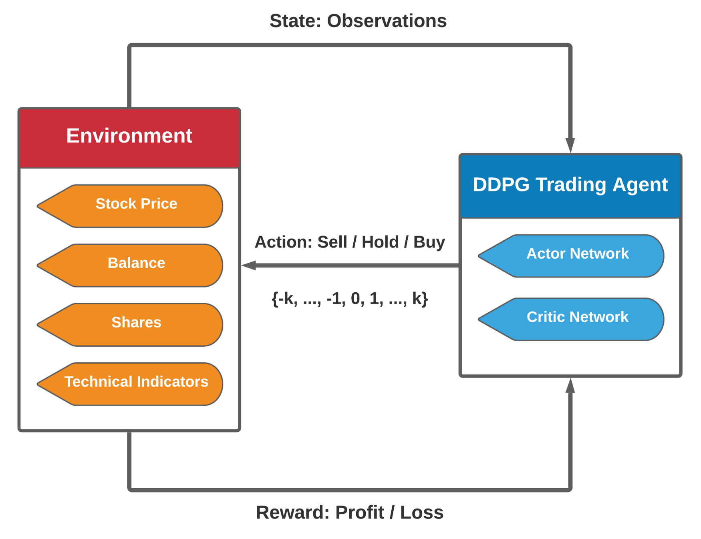
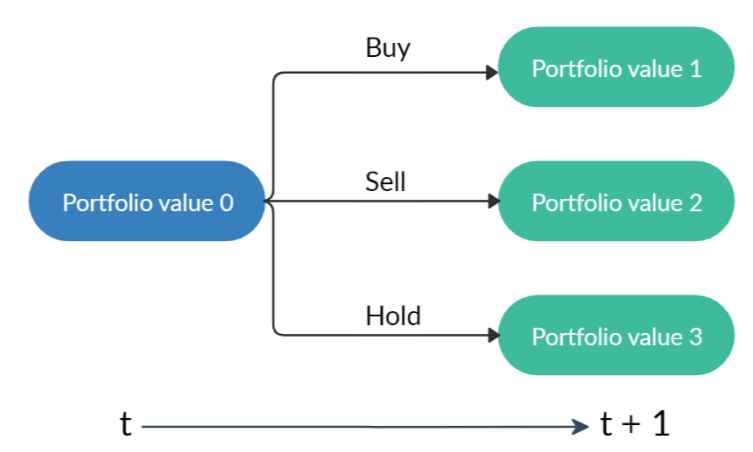

# Elegant FinRL

  This project can be regarded as [**FinRL**](https://github.com/AI4Finance-LLC/FinRL-Library) **2.0**: intermediate-level framework for full-stack developers and professionals. It borrows ideas from [ElegantRL](https://github.com/AI4Finance-LLC/ElegantRL) and [FinRL](https://github.com/AI4Finance-LLC/FinRL-Library)
  
  We maintain an **elegant (lightweight, efficient and stable)** FinRL lib, allowing researchers and quant traders to develop algorithmic strategies easily.
  
  + **Lightweight**: The core codes have less than 800 code lines, using PyTorch and NumPy.
  
  + **Efficient**: Its performance is comparable with [Ray RLlib](https://github.com/ray-project/ray).
  
  + **Stable**: It is as stable as [Stable Baseline 3](https://github.com/DLR-RM/stable-baselines3).
  

# Design Principles

  + **Be Pythonic**: Quant traders, data scientists and machine learning engineers are familiar with the open source Python ecosystem: its programming model, and its tools, e.g., NumPy.
  
  + **Put researchers and algorithmic traders first**: Based on PyTorch, we support researchers to mannually control the execution of the codes, empowering them to improve the performance over automatical libraries.
  
  + **Lean development of algorithmic strategies**: It is better to have an elegant (may be slightly incomplete) solution than a comprehensive but complex and hard to follow design, e.g., Ray RLlib [link](https://github.com/ray-project/ray). It allows fast code iteration.
  
  
# DRL Algorithms

Currently, model-free deep reinforcement learning (DRL) algorithms: 
+ **DDPG, TD3, SAC, A2C, PPO, PPO(GAE)** for continuous actions
+ **DQN, DoubleDQN, D3QN** for discrete actions
+ **MILP (learn to cut using natural evolutionay strategy)** for portfolio optimization

For DRL algorithms, please check out the educational webpage [OpenAI Spinning Up](https://spinningup.openai.com/en/latest/). 

# File Structure
<a href="https://github.com/AI4Finance-LLC/Elegant-FinRL" target="\_blank">
	

		
	

<!-- 	
<caption>Slack Invitation Link</caption>
 -->
</a>

   An agent in **agent.py** uses networks in **net.py** and is trained in **run.py** by interacting with an environment in **env.py**.

+ **net.py**    # Neural networks.
   + Q-Net,
   + Actor Network,
   + Critic Network, 
+ **agent.py**  # RL algorithms. 
   + AgentBase 
   + AgentDQN
   + AgentDDPG
   + AgentTD3
   + AgentSAC
   + AgentPPO
+ **env.py** # Stock Trading environment
+ **run.py**    # Stock Trading application
   + Parameter initialization,
   + Training loop,
   + Evaluator.
+ **StockTrading_Demo.ipynb** # One stock trading demo using PPO algorithm

# Stock Trading Problem Formulation

<a href="https://github.com/AI4Finance-LLC/Elegant-FinRL" target="\_blank">
	

		
	

<!-- 	
<caption>Slack Invitation Link</caption>
 -->
</a>

Formally, we model stock trading as a Markov Decision Process (MDP), and formulate the trading objective as maximization of expected return:
+ **State s = [b, p, h]**: a vector that includes the remaining balance b, stock prices p, and stock shares h. p and h are vectors with D dimension, where D denotes the number of stocks.
+ **Action a**: a vector of actions over D stocks. The allowed actions on each stock include selling, buying, or holding, which result in decreasing, increasing, or no change of the stock shares in h, respectively.
+ **Reward r(s, a, s’)**: The asset value change of taking action a at state s and arriving at new state s’.
+ **Policy π(s)**: The trading strategy at state s, which is a probability distribution over actions at state s.
+ **Q-function Q(s, a)**: the expected return (reward) of taking action a at state s following policy π.
+ **State-transition**: After taking the actions a, the number of shares h is modified, as shown in Fig 3, and the new portfolio is the summation of the balance and the total value of the stocks.

<a href="https://github.com/AI4Finance-LLC/Elegant-FinRL" target="\_blank">
	

		
	

<!-- 	
<caption>Slack Invitation Link</caption>
 -->
</a>

# Stock Trading Environment

### Environment Design
The environment is designed in the OpenAI gym-style since it is considered as the standard implementation of reinforcement learning environments.
+ **Initialization**: the stock data from Yahoo Finance is pre-processed, and the variables related to the stock trading problem are initialized. Before the training, an initialization function is used to create a new environment for interacting with the agent.
+ **Reset**: the state and variables of the environment are reset to the initial condition. This function is used once the simulation stops and needs to restart.
+ **Step**: the state takes an action from the agent and then returns a list of three things — the next state, the reward, the indication of whether the current episode is done or not. The way the environment computes the next state and the reward is based on the state-action transition defined in the previous blog. The step function is used when the agent collects the transitions for training usage.

### State Space and Action Space
+ **State Space**: We use a 181-dimensional vector consists of seven parts of information to represent the state space of multiple stocks trading environment: [b, p, h, M, R, C, X], where b is the balance, p is the stock prices, h is the number of shares, M is the Moving Average Convergence Divergence (MACD), R is the Relative Strength Index (RSI), C is the Commodity Channel Index (CCI), and X is the Average Directional Index (ADX).
+ **Action Space**:  As a recap, we have three types of actions: selling, buying, and holding for a single stock. We use the negative value for selling, positive value for buying, and zero for holding. In this case, the action space is defined as {-k, …, -1, 0, 1, …, k}, where k is the maximum share to buy or sell in each transaction.

### Easy-to-customize Features
+ **Initial_capital**: the initial capital that the user wants to invest.
+ **Tickers**: the stock pool that the user wants to trade with.
+ **Initial_stocks**: the initial amount of each stock and the default could be zero.
+ **buy_cost_pct, sell_cost_pct**: the transaction fee of each buying or selling transaction.
+ **Max_stock**: the user is able to define the maximum number of stocks that are allowed to trade per transaction.
+ **tech_indicator_list**: the list of financial indicators that are taken into account, which is used to define a state.
+ **start_date, start_eval_date, end_eval_date**: the training and backtesting time intervals. Thee time dates (or timestamps) are used, once the training period is specified, the rest is backtesting.

