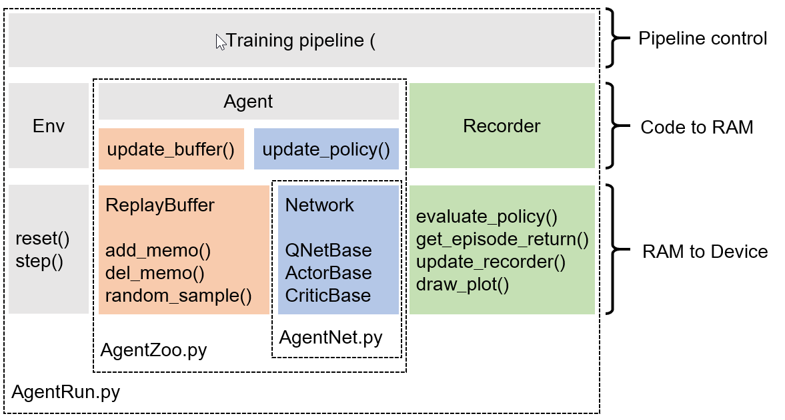

# Elegant FinRL

  This project is a solution for **FinRL 2.0**: intermediate-level framework for full-stack developers and professionals. 
  
  This project borrows ideas from [ElegantRL](https://github.com/AI4Finance-LLC/ElegantRL) and [FinRL](https://github.com/AI4Finance-LLC/FinRL-Library)
  
  We maintain an **elegant (lightweight, efficient and stable)** FinRL lib, allowing researchers and quant traders to develop algorithimc strategies easily.
  
  + **Lightweight**: The core codes have less than 800 code lines, using PyTorch, OpenAI Gym, and NumPy.
  
  + **Efficient**: Its performance is comparable with Ray RLlib [link](https://github.com/ray-project/ray).
  
  + **Stable**: It is as stable as Stable Baseline 3 [link](https://github.com/DLR-RM/stable-baselines3).
  

# Design Principles

  + **Be Pythonic**: Quant traders, data scientists and machine learning engineers are familiar with the open source Python ecosystem: its programming model, and its tools, e.g., NumPy.
  
  + **Put researchers and algorithmic traders first**: Based on PyTorch, we support researchers to mannually control the execution of the codes, empowering them to improve the performance over automatical libraries.
  
  + **Lean development of algorithmic strategies**: It is better to have an elegant (may be slightly incomplete) solution than a comprehensive but complex and hard to follow design, e.g., Ray RLlib [link](https://github.com/ray-project/ray). It allows fast code iteration.
  
  
# DRL Algorithms

  + **DDPG --> TD3, SAC, A2C, PPO(GAE)**:
  
  + **DQN --> DoubleDQN, DuelingDQN, D3QN**
  
  Please check out OpenAI Spinning Up [DRL Algorithms](https://spinningup.openai.com/en/latest/index.html)

# Training pipeline

+ Initialize the hyper-parameters using `args`
+ 初始化 `buffer=ReplayBuffer()` 用于储存回放数据
+ 初始化 `agent=AgentXXX()` 用于网络参数更新
+ 初始化 `recorder=Recorder()` 用于评估并保存模型
+ 训练开始，满足条件后会跳出while循环（条件：达到目标分数、目标步数，或者手动停止）
  + `agent.update_buffer(...)` 智能体在环境中探索规定的步数，产生数据并储存于 `buffer`。可并行
  + `agent.update_policy(...)`  智能体使用收集到的数据去更新网络。可并行
  + recorder.update_recorder(...) 对智能体的性能进行评估，保存分数最高的模型。可独立于训练流程之外

# Code Structure

  + `AgentRun.py`
    + `train_agent()` 配置训练参数，建立训练环境，选择对应算法，然后用这个函数进行训练
    + 配置训练参数 `Arguments` 提供了超参数的缺省值与解释。
    + 建立训练环境 `FinanceMultiStockEnv` 这是一个gym风格的标准训练环境，可以作为模板。    + 选择对应算法 `from AgentZoo import AgentXXX` 算法都放在 `AgentZoo.py` 里

  + `AgentZoo.py`
    + `AgentBase` 为了适应分布式探索与分布式训练，它需要以下几个功能：
    + 选择探索动作 `select_actions` 离散或连续动作空间、确定或随机策略梯度，他们产生探索动作的方式不同
    + 更新记忆回放 `update_buffer` off-policy或on-policy 的记忆回放buffer更新机制不同
    + 加载保存模型 `save_or_load_model` 用来保存分数最高的模型，这样即便后期训练不稳定也没关系
    + 创建神经网络 `from AgentNet import XXXnet` 不同DRL算法对应的神经网络放在 `AgentNet.py`

  + `AgentNet.py`
    + 所有的基类都继承了 `torch.nn.Module`，这是PyTorch创建神经网络的标准写法
    + `QNetBase` 使用`forward()` 输出离散动作的Q值
    + `ActorBase` 使用`forward()` 输出动作，使用 `get__a_noisy()` 输出带噪声的动作用于探索
    + `CriticBase` 使用`forward()` 输出Q值的期望

# API

  + `Env`

